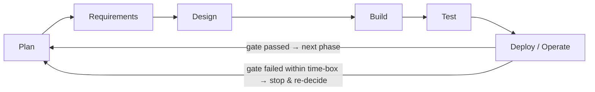
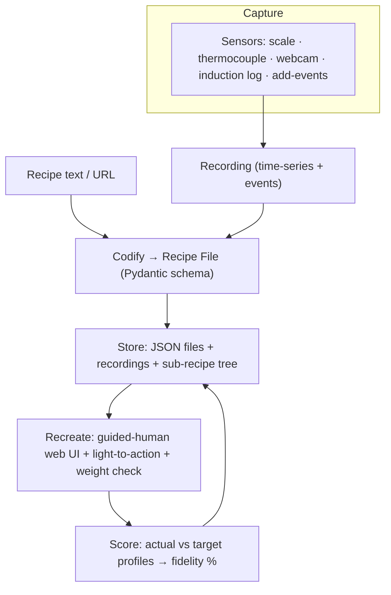

# Kitchen OS — Plan Phase (SDLC)

**v1 · 2026-06-05 18:27 IST** · governed by [`HARNESS.md`](HARNESS.md) · loop in [`WORKFLOW.md`](WORKFLOW.md)

The Plan-phase document for Kitchen OS, framed as a Software Development Life Cycle (SDLC).
Confirms the **software-first** strategy (CloudChef built the Record/Recreate software first;
robotic arms came later) and lays out scope, requirements, design/tech-stack, and how we
**measure progress** (see [`METRICS.md`](METRICS.md)).

---

## 1. SDLC model — *iterative / Agile with spike-gates*

A pure waterfall doesn't fit an R&D-heavy, single-founder, discovery project. We run an
**iterative loop** where **each Harness phase is one iteration** that passes through the SDLC
stages and must clear a **gate** before the next iteration earns spend.

| SDLC stage | What it means here | Primary artifact |
|---|---|---|
| Plan | strategy, scope, metrics (this doc) | `PLAN.md`, `HARNESS.md` |
| Requirements | what each stage of the Record→Recreate loop must do | §3 below |
| Design | architecture + tech stack + schema | §4 below |
| Build | implement the iteration's slice | code in `kitchen_os/` |
| Test | gold-set eval + fidelity scoring | `eval/`, `tests/` |
| Deploy / Operate | release CLI / web guide; run it; collect data | CI + the kitchen rig |

---

## 2. Scope of the Plan phase

**In scope now:** confirm strategy; define requirements for the Record→Recreate loop; choose
the design + tech stack; define metrics + tracking; set the iteration cadence and gates.

**Out of scope now (Harness Not-Yet list):** robot arm, Rust/streaming services, vector DB,
thermal camera, RFID, knowledge-graph DB, cloud backend. Each unlocks on a named trigger.

**Product goal (North Star — ratified in HARNESS v2; see its Milestone Ladder):**
> *Record a dish once, codify it into a sensor-grounded Recipe File, and have a **guided human
> operator who can't cook** recreate it to within an agreed **profile-fidelity %** — no robot.*

---

## 3. Requirements (high-level)

### Functional — the six loop stages
- **F1 Record** — capture synchronized, time-stamped channels during one human cook:
  **weight, temperature, colour (RGB), induction power, ingredient-add events** (+ RPM later).
  Non-intrusive; per-ingredient identity + target/actual weight.
- **F2 Codify** — segment the recording into steps; fit named **profiles**
  (temperature / induction / weight / stir); emit a versioned **Recipe File** (schema-valid).
  Cold-start path: text/URL → JSON skeleton via Claude (defines the ontology).
- **F3 Store** — Recipe File (canonical JSON) + raw recording + sub-recipe tree + ingredient
  registry; files are the source of truth.
- **F4 Recreate (guided human)** — load a Recipe File; "Google-Maps-style" step guidance +
  **light-to-action**; validate each ingredient **actual vs target weight**; run a
  **real-time closed loop** that adjusts against the recorded profiles (*not* open-loop replay).
- **F5 Score** — compare actual vs target profiles (weight curve, temperature curve & **dT/dt**,
  colour, duration) → a **fidelity score** + ranked deviations. Taste-panel later.
- **F6 Refine** — feed deviations back to tighten tolerances / re-record; accumulate recordings
  into a dataset.

### Non-functional
- **Measured ground truth** (Harness Law 4): every value from a sensor; **discrete** state
  classes and **rate-of-change** features before any continuous inference from RGB.
- **Reproducibility**, **versioned** recipe files, **observability** (log every run),
  **low cost** (cheap sensors; LLM cost tracked), **accessibility** of the operator UI.

---

## 4. Design & tech stack

**Design principles:** schema-first (the Pydantic Recipe File *is* the contract) · measured
ground truth · closed-loop recreate · modular reusable sub-recipes · **Python-first**.

### Architecture (logical)

### Stack by layer
| Layer | Now (Python-first) | Deferred (Not-Yet → trigger) |
|---|---|---|
| Lang / tooling | **Python 3.12**, `uv`, `ruff`, `mypy`, `pytest` | Rust → measured bottleneck |
| Schema / contract | **Pydantic v2** | — |
| Codify (cold-start) | **Claude Sonnet 4.6** (`claude-sonnet-4-6`) tool-use; `trafilatura`, `httpx` | — |
| Record | `opencv-python` (camera), `pyserial` (MAX6675 thermocouple + USB scale via microcontroller), CSV/Parquet logger | IR/thermal (FLIR), RPM, MQTT streaming |
| Store | JSON files (canonical); `SQLite` index later | Vector DB / TurboVec; knowledge-graph DB |
| Recreate UI | **FastAPI** + minimal HTML/vanilla-JS step-guide; live USB-scale read for weight validation | RFID tags; robot arm / ROS2 |
| Score | `numpy`, `pandas`, `matplotlib` (curve diffs) | ML profile/state models; taste-panel tooling |
| CI / deploy | **GitHub Actions** (lint+test+deploy); GitHub Pages (journal) | full kitchen install |
| Hardware (0b) | laptop/**Raspberry Pi** + USB kitchen scale + thermocouple + webcam (≤ ₹15k) | Pi 5 sensor hub, thermal cam, dispensing rig |

---

## 5. Iteration plan & gates (mapped to the Harness)

| Iter | SDLC focus | Deliverable | Gate (exit criteria) | Box |
|---|---|---|---|---|
| **0a** *(now)* | Reqs+Design+Build | Recipe File **schema** + text→JSON cold-start CLI + 5 gold recipes + eval | 100% schema-valid · ≥90% gold-step accuracy · every state step has an `observable` | ~2 wk · ₹0 |
| **0b** | Build+Test | **Record** rig: one station, one dish → first sensor-grounded Recipe File | one recording fully codified; every value sensor-sourced | ~3 wk · ≤₹15k |
| **0c** | Build+Test+Deploy | **Recreate** (guided human) + **Score** | recreate the dish within agreed fidelity % — no robot | ~3 wk |
| **1** | Iterate | more channels (IR/RPM/add-detect), more dishes, sub-recipe reuse | reliable record+recreate across ≥3 dishes | — |
| **2** | Iterate | dataset + knowledge graph; predictive/state models | auto-label loop proven | — |
| **3+** | Iterate | swap guided-human → robot actuator | state engine + fidelity proven | — |

---

## 6. Risks & mitigations (Plan phase)

| Risk | Mitigation |
|---|---|
| Ground-truth labels are the hard part | sensors as **auto-labelers** (Law 4); discrete classes first |
| Sensor-integration friction | start with **USB scale only**, add channels incrementally |
| LLM extraction fidelity / cost | gold-set eval + confidence flags; Haiku for bulk; track ₹/recipe |
| Scope creep | Harness **Not-Yet list** + gate discipline |
| Solo-founder bandwidth | tiny, time-boxed, gated iterations |
| Hardware lead time (India) | **software-first**; hardware deferred to 0b |

---

## 7. Harness amendment — ratified (HARNESS v2)

The Harness **North Star** is now *"record a dish once and have a guided operator recreate it
to within X % profile fidelity."* State-understanding is **not** dropped — *"can the system
name the cooking state?"* is **milestone M3** (early) on the Harness **Milestone Ladder**,
which maps onto the iteration plan in §5. We climb the ladder progressively; the North Star is
the final rung.

---

## 8. Cadence & tracking

- **Per iteration (1–2 wk):** Plan→…→Gate review; update [`METRICS.md`](METRICS.md) + journal.
- **Per session:** append a changelog entry + bump the stamp (Harness Law 9).
- **Metrics:** DORA (delivery scaffold) + flow + Kitchen-OS leading indicators — see `METRICS.md`.
