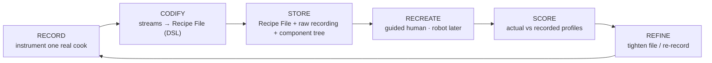
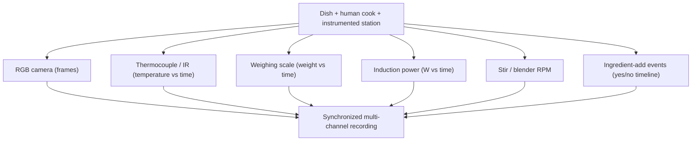
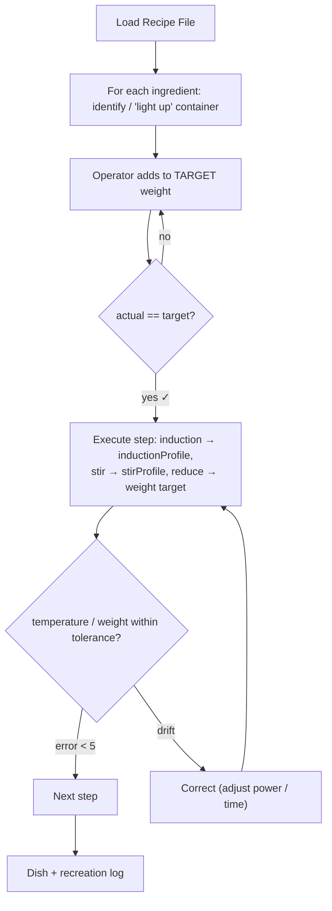

# Kitchen OS — Workflow & Process Map

**v1 · 2026-06-05 16:15 IST**

How Kitchen OS plays out, reframed around CloudChef's demonstrated model
(*"Record & Recreate Taste"*, which they brand **KitchenOS**). The unit of value is a
**sensor-grounded Recipe File**. The actuator that recreates the dish — a **guided human
first**, a robot much later — is interchangeable. Governed by [`HARNESS.md`](HARNESS.md).

> **Evidence base:** frame analysis of CloudChef's *Record & Recreate Taste* video — the
> "Codified File" (6 recorded channels), tagged/weighed GN containers, induction/temperature/
> weight profiles, dish component-trees, and a human-operator recreation flow.

---

## The core loop

The product is the loop, not any single stage. "Cooking-state understanding" is one channel
inside RECORD — necessary, but not the whole game.

---

## Stage A — RECORD *(instrument one real cook)*

Capture a human cooking one dish on an instrumented station (the "Kitchen Black Box").

| Channel | Sensor | CloudChef evidence | Ours (Phase 0b) |
|---|---|---|---|
| Weight vs time | USB kitchen scale | "Weighing Scale 1kg/0kg"; weight→TARGET curves | **Yes** (cheapest, richest signal) |
| Temperature vs time | Thermocouple (MAX6675) | "180 °C", probes "346/71 °C", thermal 25–100 °C | **Yes** |
| Induction power vs time | Log cooktop setting | "Power Level 5kW/0kW", inductionProfile | If the plate exposes it; else manual log |
| Ingredient-add events | Manual key / scale step-change | "Ingredient Add yes/no" | **Yes** (key-press to start) |
| RGB frames | Webcam | "Camera" strip | Yes (supporting / future state model) |
| Stir / RPM | — | "Stir active", "620 RPM" | Defer (Not-Yet until needed) |
| IR / thermal field | FLIR | thermal frames | Defer (Not-Yet — thermocouple first) |

**Per-ingredient identity:** each prepped item lives in a tagged, weighed container
(CloudChef: `GN19 #34GH27`, "CARROT CHOP 2 — 150 GM / 150 GM ✓"). Ours: an ID + target +
actual weight per ingredient. **Output:** one synchronized recording + event log.

---

## Stage B — CODIFY *(recording → Recipe File)*

1. **Segment** the recording into steps using ingredient-add events and power/temperature
   transitions as natural boundaries.
2. **Fit profiles** per step → named, reusable profiles: `temperatureProfile`,
   `inductionProfile`, `weightProfile`, `stirProfile` (CloudChef references these by hash).
3. **Emit the Recipe File** — a small DSL: equipment header · profiles · `add_ingr …*gm` ·
   `action …` · `decision … if temperature_error < 5` · `while … weight_loss` · breakpoints ·
   `duration`.
4. **Link** to the dish **component tree** (dish → sub-recipes → ingredients) = the knowledge
   graph; reuse shared sub-recipes (e.g. Veg Stock).

> **Our v0.1 text→JSON is the cold-start of CODIFY:** it builds the *skeleton + ontology*
> (actions, `observable`s) from text. A real Recording then *fills the skeleton with measured
> profiles.* Same schema family, two sources (text now, sensors next).

**Output:** a versioned, sensor-grounded **Recipe File** — the unit of value.

---

## Stage C — STORE

Recipe File (canonical JSON/DSL) + raw recording + component-tree node + ingredient registry
(ID, target weight, provenance). Files are canonical (Harness Law 5); a knowledge-graph DB
stays on the **Not-Yet list** until the corpus justifies it.

---

## Stage D — RECREATE *(guided human first; robot is a later swap-in)*

This mirrors CloudChef's "ADD LIT UP CONTAINER" / weight-validated operator flow
("ARBORIO RICE 207 GM", "✓150/150"). **No robot in the MVP.** **Output:** recreated dish +
a recreation log of *actual* profiles.

---

## Stage E — SCORE *(fidelity)*

Compare recreation's actual profiles against the recorded targets, per channel:

- weight-vs-time curve error · temperature-vs-time error · final weight · total duration ·
  induction-power match.
- Roll up to a **fidelity score**; flag the largest deviations.
- Taste is the ultimate metric → proxy = profile fidelity now, human taste-panel later.

**Output:** fidelity score + ranked deviations. This is the project's real success metric.

---

## Stage F — REFINE

Use deviations to tighten tolerances / re-record. Accumulate Recordings → dataset → (later)
models that *predict* profiles or *detect* states from cheaper sensors.

---

## How we build it — toy-scale first (per the harness)

| Phase | Build | Sensors / cost | Gate |
|---|---|---|---|
| **0a** *(now)* | CODIFY cold-start: text→JSON skeleton **+ define the Recipe File schema** (profiles, events, component tree) | ₹0 | 100% schema-valid · ≥90% gold-step accuracy |
| **0b** *(Record spike)* | Instrument ONE station, record ONE dish/step → first **sensor-grounded Recipe File** | scale + thermocouple + webcam (+ induction log) · ≤ ₹15k | one recording fully codified; every value sensor-sourced |
| **0c** *(Recreate spike)* | Human recreates from the Recipe File; system validates weight-to-target + temp-to-profile; **SCORE fidelity** | same rig | recreate the dish within an agreed fidelity % — **no robot** |
| **1** | Add channels (IR, RPM, add-detection), more dishes, reuse shared sub-recipes | incremental | reliable record+recreate across ≥3 dishes |
| **2** | Dataset + knowledge graph at scale; predictive/state models | — | auto-label loop proven |
| **3+** | Swap guided-human operator → robot actuator | — | state engine + fidelity proven |

---

## What changes vs the old plan

- **North-star measure:** from *"name the cooking state"* → **"record a dish and recreate it
  within X % profile fidelity."**
- **MVP:** the full **Record → Recreate** loop on ONE dish with cheap sensors and a **guided
  human** — not a vision classifier, not a robot.
- **Ground truth:** **measured** (weight / temp / power / time / RPM), never inferred from RGB.
- **New stage early:** **RECREATE (human-guided)** + **SCORE** — proves reproducible taste,
  the actual product, with zero robotics.
- **Knowledge graph / dataset / robot:** unchanged — still later phases, still on the Not-Yet
  list until their triggers fire.
